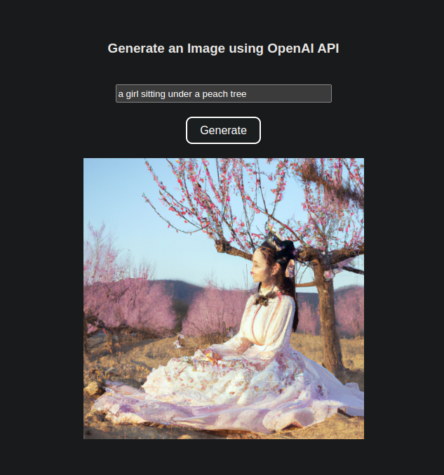

# NeuralScape

## Description
A Vite + React application which uses the OpenAI API to generate artificial images for a specific prompt.

## Execution
- create a local Vite + React app using `npm create vite@latest`
- copy necessary files from the repo or fork it 
- create your own API Key from the [OpenAI Dev Portal](https://platform.openai.com/)
- Copy your key and paste it into the .env file
- run the app using `npm run dev` which deploys it in the development mode